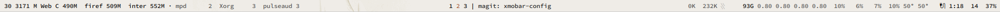
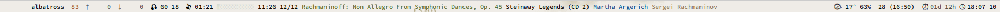

# xmobar-config

Configurations for xmobar, as Haskell programs.

Here's (an old version of) `xmobar-top`:

and an (equally outdated) screnshot of `xmobar-bottom`:

which are meant to be used together; `xmobar-single` combines the two,
*mutatis mutandis*:

There is also a couple of bars that output text, for use within an emacs tab
bar (`xmobar-emacs`) and with swaybar (`xmobar-sway`).
